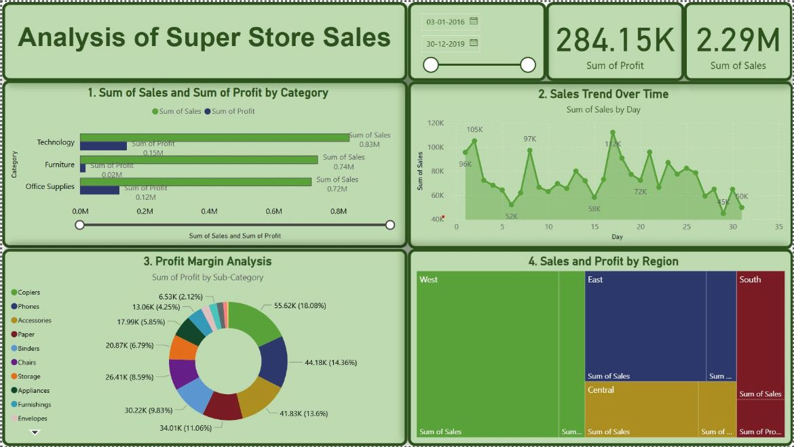

# Task 2 – Data Visualization and Storytelling

**Tool Used:** Power BI  
**Dataset:** Superstore.csv

---

## Objective

To create interactive and insightful data visualizations from the Superstore dataset and communicate key business insights through visual storytelling.

---

## Dashboard Overview

The dashboard consists of the following visual elements:

1. **Sales and Profit by Category**  
   Horizontal bar chart comparing total sales and profit for each main product category.

2. **Sales Trend Over Time**  
   Line chart showing daily sales fluctuations across a selected time period.

3. **Profit Margin Analysis by Sub-Category**  
   Donut chart highlighting each sub-category’s contribution to overall profit.

4. **Sales and Profit by Region**  
   Tree map visualizing regional performance based on total sales and profit.

5. **KPI Cards**  
   Summarized total profit and total sales for quick overview.

---

## Key Insights

-  **Technology** category contributes the highest profit, while **Furniture** brings the lowest despite similar sales volume.
-  **Chairs** and **Binders** are major contributors to profit within Office Supplies.
-  **West** region outperforms others in both sales and profit. **South** region lags behind.
-  Sales show clear **daily fluctuations**, suggesting seasonal patterns or promotional peaks.

---

##  Power BI Features Used

- KPI Cards
- Slicers (Date Range Filter)
- Interactive Bar, Line, Donut, and Tree Map Charts
- Tooltip-based insights
- Clean layout and color-coded categories

---

##  Dashboard 

---

## Conclusion

This Power BI dashboard enables decision-makers to identify high-performing categories, monitor regional sales trends, and optimize strategies for underperforming segments. Visual storytelling supports faster and more informed business decisions.

---
## Author
Rajeshwari  
Elevate Labs Internship – Task 2
